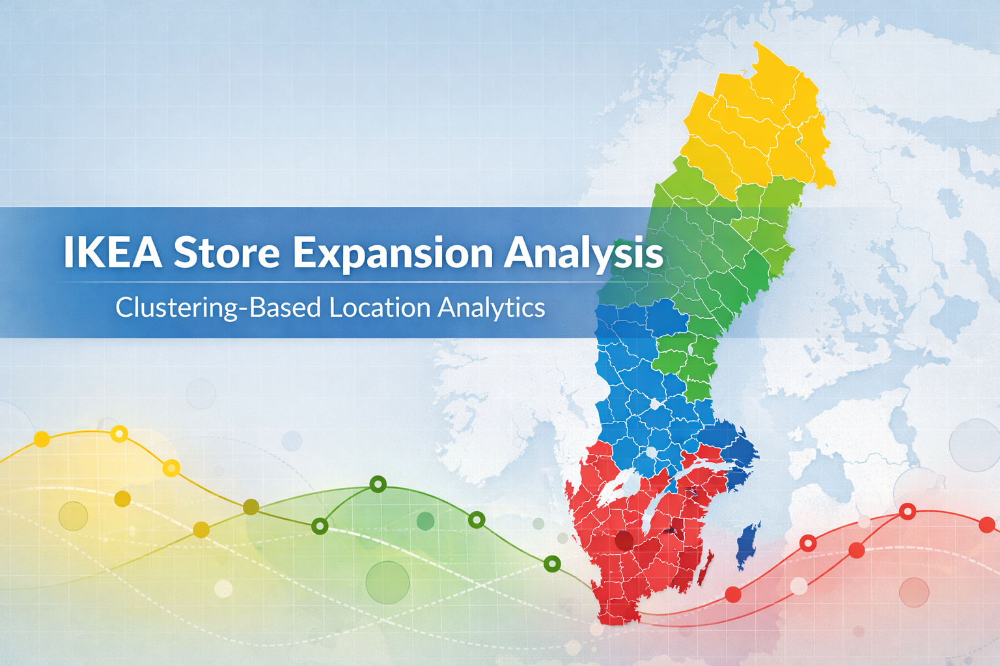
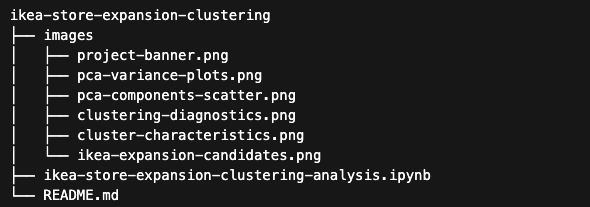
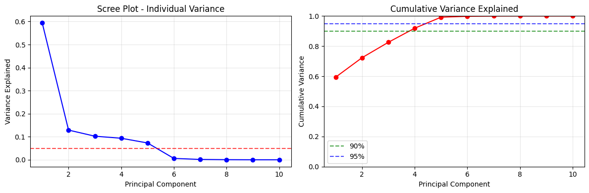
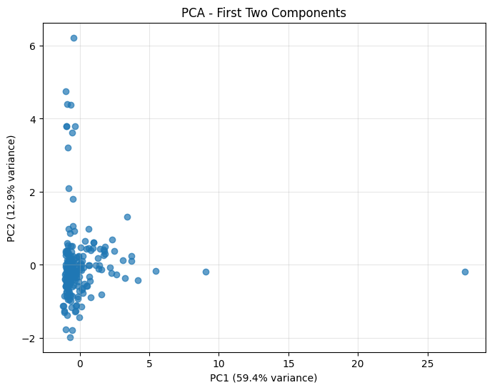
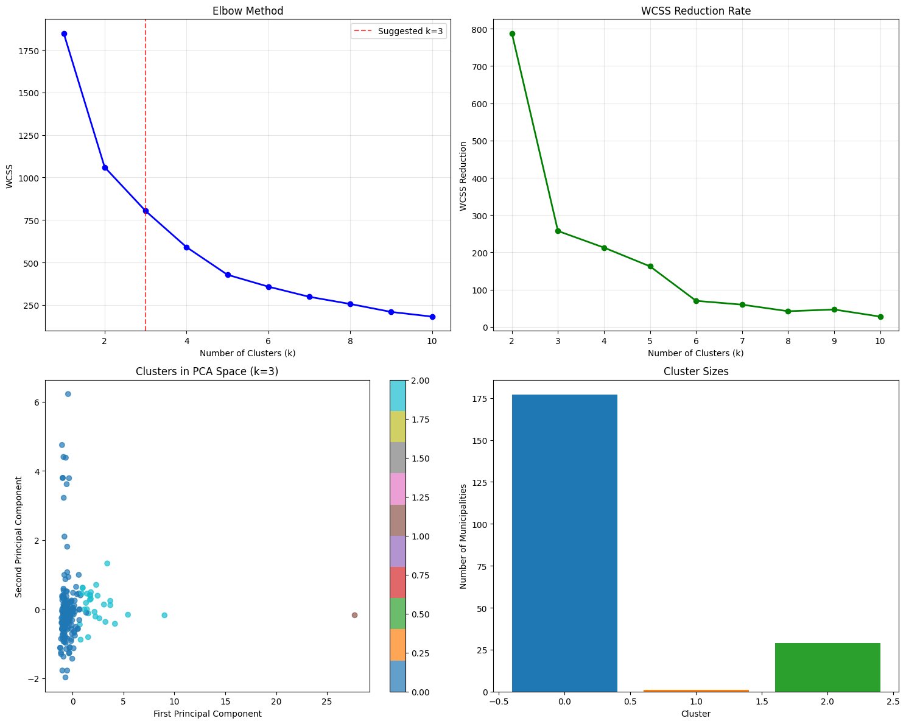
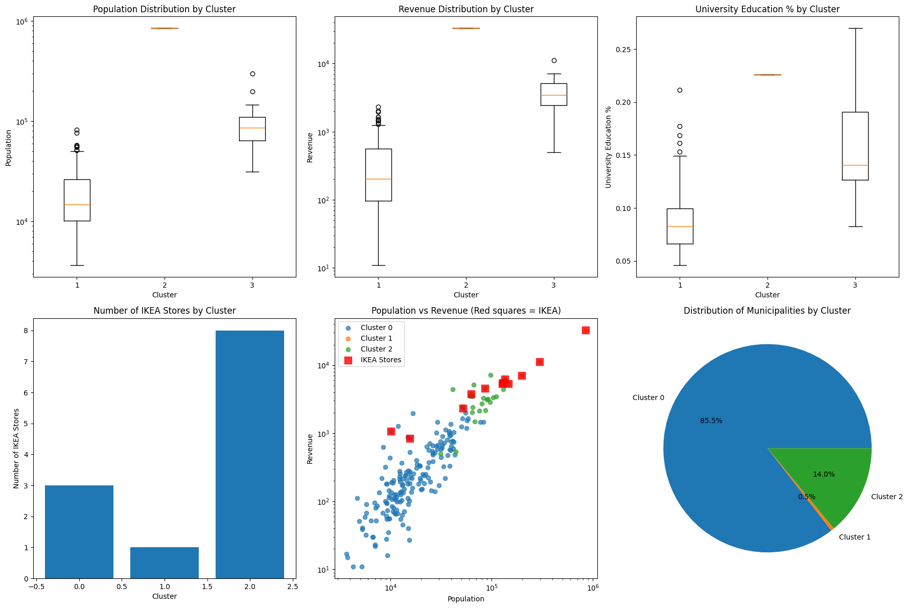
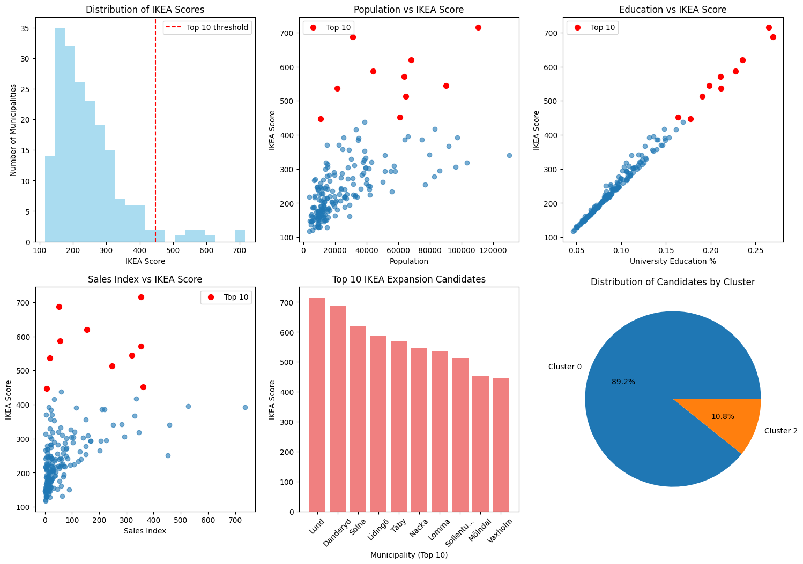

# IKEA Store Expansion

## Overview

This analysis applies unsupervised machine learning to Swedish municipality data to explore potential locations for future IKEA store expansion.

Using Principal Component Analysis (PCA) and K-Means clustering, municipalities are grouped based on similarities in population size, education levels, economic activity, and retail indicators. These clusters are then compared with municipalities where IKEA already operates stores in order to identify areas with similar market characteristics but no current IKEA presence.

The analysis demonstrates how data-driven segmentation and scoring can support retail location strategy by highlighting municipalities that resemble existing successful IKEA markets.

## Background

Selecting the right store location is an important strategic decision for retail companies such as IKEA.  Each new store requires major capital investment and long-term operational commitment, making location selection a critical driver of profitability and market growth.

However, determining where to expand is not straightforward. Municipalities differ in population size, education levels, economic activity, retail performance, and infrastructure. These factors shape the potential demand for retail stores. Rather than evaluating each municipality individually, I analyse data to reveal underlying patterns across Swedish municipalities to help IKEA decide on location for expansion. By identifying groups of municipalities with similar demographic and economic characteristics etc, it becomes possible to understand where IKEA currently operates successfully and where similar market conditions may exist for possible expansion.

The analysis combines **machine learning, dimensionality reduction, and market scoring** to highlight municipalities that resemble existing IKEA markets but do not yet have a store. 
It combines **data cleaning**, **feature scaling**, **Principal Component Analysis (PCA)**, **K-Means clustering**, and a custom **IKEA attractiveness score** to identify municipalities that resemble locations where IKEA already operates.

---

## Goal

The aim of this analysis is to identify Swedish municipalities that may be suitable for future IKEA expansion.

Rather than looking at one variable in isolation, the analysis groups municipalities based on a combination of market-related indicators such as:

- population
- revenue
- employment
- university education levels
- sales index
- productivity
- infrastructure
- border status

Then it compares those clusters with municipalities where IKEA already has stores and ranks additional candidates for expansion.

---

## Structure

---

## Dataset

The dataset contains Swedish municipality-level indicators for the year 2010.

### Variables used in the analysis

- **Kommun_code** – municipality code
- **Year** – observation year
- **Kommun_name** – municipality name
- **Revenue** – revenue indicator
- **Employee** – employee indicator
- **Population** – municipality population
- **Population_University** – number of university-educated residents
- **Percent_University** – share of university-educated residents
- **Productivity** – productivity indicator
- **SalesIndex** – retail sales index
- **Infrast** – infrastructure indicator
- **Border** – whether the municipality is a border municipality

For PCA and clustering, I removed the textual columns `Kommun_name` and `Kommun_code` and worked with the numeric variables.

> Note: The dataset is not included in this repository.

---

## Methodology

### 1. Data preparation
The dataset is loaded, inspected, and cleaned.  
Categorical/textual columns are removed before PCA, and the remaining columns are converted to numeric values. Missing values are checked before modelling.

### 2. Standardisation
Because PCA is sensitive to scale, the variables are standardised using `StandardScaler`.

### 3. Dimensionality reduction with PCA
PCA is applied to reduce dimensionality while retaining most of the information in the dataset.

I evaluated the cumulative explained variance and selected the number of components needed to retain approximately **95%+ of the variance**.  
This results in reducing the original variables to **5 principal components**, while preserving about **99% of the variance**.

### PCA projection of municipalities
The scatter plot below shows Swedish municipalities projected onto the first 2 principal components.

### 4. Cluster selection
The **Elbow method** is used to test different numbers of clusters (`k=1` to `k=10`) and identify an appropriate value of `k` for K-Means.

### Clustering diagnostics
The figure below summarises several diagnostics used to evaluate the clustering model, including the elbow method, reduction in within-cluster sum of squares, the cluster structure in PCA space, and the distribution of municipalities across clusters.

### 5. K-Means clustering
K-Means is then applied to the PCA-transformed data to group Swedish municipalities with similar profiles.

### 6. Comparison with existing IKEA locations
A binary `has_ikea` flag is added using a list of municipalities where IKEA already has stores.  
This allows the analysis to examine which clusters already contain successful IKEA locations.

---

## Key Analytical Outputs

The notebook includes:

- variance explained by principal components
- scree and cumulative variance plots
- elbow curve for choosing the number of clusters
- PCA cluster visualisation
- cluster summaries and cluster-level averages
- comparison of municipalities with and without IKEA
- ranked expansion candidates
- final top recommendations

---

## Cluster Characteristics

To better understand the differences between clusters, several key indicators were compared across clusters, including population, revenue levels, and the share of residents with university education.

The figure below also shows how existing IKEA locations relate to these clusters.

---

## Expansion Candidate Scoring

Municipalities without IKEA stores were filtered from clusters that already contain IKEA locations.  
These municipalities were then scored using a custom **IKEA_Score** based on several market indicators.

The scoring model combines:

- Population
- Percent_University
- SalesIndex
- Revenue
- Infrastructure

The following weights were applied during scoring:

- **Population**: 30 points
- **University education**: 25 points
- **Sales index**: 20 points
- **Revenue**: 15 points
- **Infrastructure**: 10 points

---

## Top IKEA Expansion Candidates

Using the scoring model, municipalities with characteristics similar to successful IKEA markets were ranked.

The analysis highlights municipalities that combine strong population bases, higher education levels, and strong retail indicators.

---

## Top Recommendations

The final top 3 recommendations:

1. **Lund**
2. **Täby**
3. **Växjö**

The reasoning includes market attractiveness, education levels, population, and geographic diversification.

---

## Key Insights

1. **Municipalities naturally group into distinct market segments.**  
   Clustering reveals clear differences between small, medium, and large municipalities based on population, economic activity, and infrastructure indicators.

2. **IKEA stores are concentrated in specific clusters.**  
   Existing IKEA locations are not randomly distributed but tend to appear in particular clusters with strong demographic and economic characteristics.

3. **Clusters with existing IKEA stores provide a benchmark for expansion.**  
   By identifying municipalities that fall into the same clusters as current IKEA locations, the analysis highlights areas that share similar market conditions.

4. **Population, education levels, and retail strength are key indicators.**  
   Municipalities with larger populations, higher university education rates, and stronger retail activity closely resemble the profile of locations where IKEA currently operates.

5. **The model identifies municipalities with similar characteristics but no IKEA store.**  
   These municipalities represent potential expansion opportunities where market conditions appear comparable to existing successful locations.

---

## Business Impact

Why does this matter?

Instead of using intuition alone, it shows how demographic, economic, and retail-related indicators can be combined to identify municipalities with characteristics similar to existing successful markets.
This is a good example of how clustering can support a real business decision.

---

## Tools Used

- Python
- pandas
- NumPy
- scikit-learn
- matplotlib
- seaborn

---

## Future Improvements

Some possible next steps for this project would be:

- add geographic distance explicitly to avoid recommending locations too close to existing IKEA stores
- validate the score against actual IKEA site-selection logic
- compare K-Means with other clustering methods
- visualise recommendations on a map of Sweden
- turn the scoring model into an interactive decision tool

---

## Repository Contents

- `ikea-store-expansion-clustering-analysis.ipynb` – full notebook with analysis, outputs, and recommendations
- `images/` – visual assets for the README
- `README.md` – project overview
